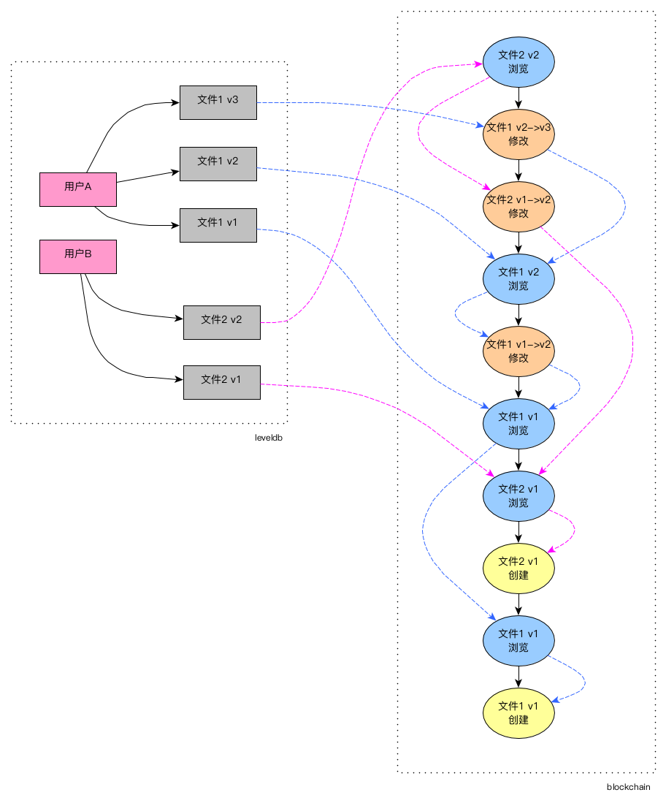

## 在区块链上构建链表


### 1. 概述

​		区块链具有分布式、去中心化、防篡改等特性。但是存储于区块链上交易数据不方便进行有效检索。链表是基础的数据结构，可以不按线性顺序存储数据，针对特定需求构造的链表可以实现有效的数据检索。因此，将区块链和链表结合，基于区块链存储构建链表，可以实现区块链交易数据的有效检索。
​		现有典型区块链应用实现（例如以太坊、超级账本Fabric）比较完备，但是过于复杂，例如以太坊基于工作量证明实现共识（挖矿），交易吞吐量受限；Fabric基于PBFT共识算法，但是实现过于复杂，所有Fabric应用均需要基于docker容器（称为“链码”的模块），增加节点运维成本。
​		因此，在本次实现中，使用Tendermint作为区块链共识引擎实现轻量化区块链应用，便于维护。去中心化、分布式存储链上信息；使用LevelDB嵌入式数据库存储链表索引数据。以记录文件操作历史为使用背景案例，实现了：（1）交易数据（文件信息、用户信息、操作记录等）链上存储，实现防篡改和可追溯；（2）基于特定键值（文件信息或用户信息）检索区块链交易数据；（3）节点分布式去中心化部署，允许1/3节点故障仍可以正常工作。


### 2. 设计概要：

#### 2.1 基于区块链的链表概念图



#### 2.2 交易数据

​		交易数据是存储在区块链上区块中的数据，一次交易存储在一个区块上。本案例中一次交易可以是一次文件创建、浏览或修改，每一次操作都会生成一个区块。理论上交易数据可以记录任何数据。交易数据按发生的时间顺序存储在区块链上，因此当检索具体某个交易时，最坏情况需要全遍历所有区块。


#### 2.3 链表索引数据

​		根据需要检索的键值构建链表，将链表索引存储在节点的LevelDB上。同时，为了维护链表的正常链接，在添加区块链交易数据时，需要保存各区块之间的链表索引关系，保持链表的有效性。如上图，在“文件1v1”创建时，生成第1个区块，此时LevelDB中“文件1v1”索引指向第1个区块，随着交易的发生，“文件1v1”在不断被浏览和修改（修改后文件用“v2”、“v3”表示），LevelDB的文件索引也持续变化，始终指向链表的顶部，每个区块之间随着区块的增加，也按键值（文件哈希）保持一点的链接关系。
​		当进行检索时，先根据键值（文件哈希）在LevelDB索引中检索到对应的链表顶部，然后在通过链表进行具体交易数据的检索。因此，检索的时间复杂度最大为O(n)，n为单个链表的长度。


#### 2.4 区块链共识引擎

​		Tendermint是一个业务无关的区块链共识引擎，因此基于此框架开发的应用程序天然具备区块链的特性。各节点之间基于P2P报文的TCP连接进行通信，基于BFT算法的故障容错机制，基于权益证明（proof of stake）的共识算法，具备高吞吐量的去中心化分布式架构。Tendermint提供应用程序区块链接口（ABCI），将区块链功能与业务逻辑分离。传统的区块链开发过程，在创建具体的区块链时，开发人员必须非常谨慎地设计消息处理程序，ABCI架构提供了一个范式来减轻开发人员的负担。 下图展示了通过ABCI的消息流：


### 3. 数据结构设计

#### 3.1交易数据

- 交易数据存储于各节点，分布式去中性化存储；

- 一个区块存储一次交易数据。交易定义：

  （1） 一次文件创建；

  （2） 一次文件修改；

  （3） 一次文件浏览；

- 一次交易数据内容包括：
  （1）文件hash（唯一表示文件，例如：使用IPFS生成的文件hash）；
  （2）文件宿主用户id；
  （3）交易动作（创建、浏览、修改）；
  （4）旧文件hash（文件修改时需提供）；
  （5）浏览用户id（文件浏览时需提供）；
  （6）文件名（可为空）
  
- Go 语言定义

```go
// 交易请求数据
type TxReq struct {
	UserId      string `json:"uid"` // 文件主的用户id
	FileHash    string `json:"fhash"` // 文件hash
	OldFileHash string `json:"ofhash"` // 旧文件的hash (如果 action==修改 需提供)
	FileName    string `json:"fn"` // 文件名，可为空
	ReaderId    string `json:"rid"` // 浏览文件的用户id （如果 action==浏览 需提供）
	Action      byte   `json:"act"` // 0x01 文件建立， 0x02 文件浏览， 0x03 文件修改
}
```


#### 3.2链表索引数据

- 链表索引数据存储在节点的LevelDB数据库，不在区块数据中。因为索引数据是在交易处理过程中产生，会随交易在各节点间复制，因此也具备去中心化分布式存储的特性；
- 链表索引数据的目的是实现（1）保存特定键值对应链表的表头索引，（2）区块之间的链表关系索引；
- LevelDB是一个高性能Key-value数据库，物理上不存在“表”的概念，可以通过key的前缀进行逻辑分表：

| 前缀       | key             | value     |
| ---------- | --------------- | --------- |
| blockLink: | 区块高度        | 区块高度  |
| fileLink:  | 文件hash        | 区块高度  |
| userFile:  | 用户id:文件hash | file_data |

> 说明：

1. Key中数据段用冒号":"分隔
2. file_data的Go定义：

```go
type FileData struct {
	FileName    string `json:"fn"` // 文件名，可为空
	Modified    bool `json:"is_mod"` // 文件是否已修改
}
```

- blockLink 描述区块之间的链接关系；
- fileLink 保存文件对应链表的表头索引；
- userFile 保存用户与文件的关系；
- 文件被修改后，新文件仍然链接旧文件的链表，保持文件历史的连续性；


### 4. 使用示例

#### 4.1 本地多节点测试

编译

```shell
$ make build
```


初始化

```shell
$ ./mloab init --home n1
$ ./mloab init --home n2
```

复制创世块

```shell
$ cp n1/config/genesis.json n2/config/
```

获取n1节点id

```shell
$ ./mloab show_node_id --home n1
```

修改n2/config/config.toml

```toml
proxy_app = "tcp://127.0.0.1:36658"
laddr = "tcp://127.0.0.1:36657"
laddr = "tcp://0.0.0.0:36656"
persistent_peers = "b2c82964b2c67236f94a84aa19b0fda6e91869a0@127.0.0.1:26656"
```

启动节点

```shell
$ ./mloab node --home n1
$ ./mloab node --home n2
```

查询验证节点信息

```shell
$ curl http://localhost:26657/validators
```

查询网络信息

```shell
$ curl http://localhost:26657/net_info
```


#### 4.2 交易数据上链

交易提交的json格式

```json
{
	"uid": "abc",  // 文件主的用户id
	"fhash": "...", // 文件hash
	"ofhash": "...", // 旧文件的hash (如果 act==修改 需提供)
	"fn": "file.txt", // 文件名，可为空
	"rid": "def", // 浏览文件的用户id （如果 act==浏览 需提供）
	"act": 1,  // 1 文件建立， 2 文件浏览， 3 文件修改， 4 文件删除
    "nonce" : "...", // 随机字符串（如果能保证tx提交内容不重复，此字段可不用）
}
```

新建

```shell
$ curl -g 'http://localhost:26657/broadcast_tx_commit?tx="{\"fhash\":\"1234\",\"uid\":\"abc\",\"act\":1}"'
```

浏览

```shell
$ curl -g 'http://localhost:26657/broadcast_tx_commit?tx="{\"fhash\":\"1234\",\"uid\":\"abc\",\"act\":2,\"rid\":\"xyz\",\"nonce\":123}"'
```

修改

```shell
$ curl -g 'http://localhost:26657/broadcast_tx_commit?tx="{\"fhash\":\"5678\",\"uid\":\"abc\",\"act\":3,\"ofhash\":\"1234\"}"'
```


#### 4.3 链上数据检索

检索提交的json格式

```json
{
    "user_id": "abc", // 文件主的用户id，action==2时提供
    "file_hash": "1234",  // 文件hash，action==1时提供
    "action": 1, // 1 查询文件历史, 2 查询用户的文件列表
}
```

文件操作历史

```shell
$ curl -g 'http://localhost:26657/abci_query?data="{\"fhash\":\"5678\",\"act\":1}"'
{
  "jsonrpc": "2.0",
  "id": -1,
  "result": {
    "response": {
      "code": 0,
      "log": "file history",
      "info": "",
      "index": "0",
      "key": null,
      "value": "W3sidHhfZGF0YSI6eyJ1aWQiOiJhYmMiLCJmaGFzaCI6IjU2NzgiLCJvZmhhc2giOiIiLCJmbiI6IiIsInJpZCI6Inh5eiIsImFjdCI6Mn0sInRpbWUiOiIyMDIwLTA4LTA3VDAyOjI3OjM1Ljc1MjI0MzQyMVoifSx7InR4X2RhdGEiOnsidWlkIjoiYWJjIiwiZmhhc2giOiI1Njc4Iiwib2ZoYXNoIjoiMTIzNCIsImZuIjoiIiwicmlkIjoiIiwiYWN0IjozfSwidGltZSI6IjIwMjAtMDgtMDdUMDI6Mjc6MTIuODUzMzc3ODA0WiJ9LHsidHhfZGF0YSI6eyJ1aWQiOiJhYmMiLCJmaGFzaCI6IjEyMzQiLCJvZmhhc2giOiIiLCJmbiI6IiIsInJpZCI6Inh5eiIsImFjdCI6Mn0sInRpbWUiOiIyMDIwLTA4LTA3VDAyOjI2OjE0LjU2ODIyMjgwNFoifSx7InR4X2RhdGEiOnsidWlkIjoiYWJjIiwiZmhhc2giOiIxMjM0Iiwib2ZoYXNoIjoiIiwiZm4iOiIiLCJyaWQiOiJ4eXoiLCJhY3QiOjJ9LCJ0aW1lIjoiMjAyMC0wOC0wN1QwMjoyNDo0OC44ODEzNDQxNzRaIn0seyJ0eF9kYXRhIjp7InVpZCI6ImFiYyIsImZoYXNoIjoiMTIzNCIsIm9maGFzaCI6IiIsImZuIjoiIiwicmlkIjoiIiwiYWN0IjoxfSwidGltZSI6IjIwMjAtMDgtMDdUMDI6MTU6NTEuMzMxMzEyMzYxWiJ9XQ==",
      "proof": null,
      "height": "0",
      "codespace": ""
    }
  }
}

$ echo "W3sidHhfZGF0YSI6eyJ1aWQiOiJhYmMiLCJmaGFzaCI6IjU2NzgiLCJvZmhhc2giOiIiLCJmbiI6IiIsInJpZCI6Inh5eiIsImFjdCI6Mn0sInRpbWUiOiIyMDIwLTA4LTA3VDAyOjI3OjM1Ljc1MjI0MzQyMVoifSx7InR4X2RhdGEiOnsidWlkIjoiYWJjIiwiZmhhc2giOiI1Njc4Iiwib2ZoYXNoIjoiMTIzNCIsImZuIjoiIiwicmlkIjoiIiwiYWN0IjozfSwidGltZSI6IjIwMjAtMDgtMDdUMDI6Mjc6MTIuODUzMzc3ODA0WiJ9LHsidHhfZGF0YSI6eyJ1aWQiOiJhYmMiLCJmaGFzaCI6IjEyMzQiLCJvZmhhc2giOiIiLCJmbiI6IiIsInJpZCI6Inh5eiIsImFjdCI6Mn0sInRpbWUiOiIyMDIwLTA4LTA3VDAyOjI2OjE0LjU2ODIyMjgwNFoifSx7InR4X2RhdGEiOnsidWlkIjoiYWJjIiwiZmhhc2giOiIxMjM0Iiwib2ZoYXNoIjoiIiwiZm4iOiIiLCJyaWQiOiJ4eXoiLCJhY3QiOjJ9LCJ0aW1lIjoiMjAyMC0wOC0wN1QwMjoyNDo0OC44ODEzNDQxNzRaIn0seyJ0eF9kYXRhIjp7InVpZCI6ImFiYyIsImZoYXNoIjoiMTIzNCIsIm9maGFzaCI6IiIsImZuIjoiIiwicmlkIjoiIiwiYWN0IjoxfSwidGltZSI6IjIwMjAtMDgtMDdUMDI6MTU6NTEuMzMxMzEyMzYxWiJ9XQ==" | base64 -d
[{"tx_data":{"uid":"abc","fhash":"5678","ofhash":"","fn":"","rid":"xyz","act":2},"time":"2020-08-07T02:27:35.752243421Z"},{"tx_data":{"uid":"abc","fhash":"5678","ofhash":"1234","fn":"","rid":"","act":3},"time":"2020-08-07T02:27:12.853377804Z"},{"tx_data":{"uid":"abc","fhash":"1234","ofhash":"","fn":"","rid":"xyz","act":2},"time":"2020-08-07T02:26:14.568222804Z"},{"tx_data":{"uid":"abc","fhash":"1234","ofhash":"","fn":"","rid":"xyz","act":2},"time":"2020-08-07T02:24:48.881344174Z"},{"tx_data":{"uid":"abc","fhash":"1234","ofhash":"","fn":"","rid":"","act":1},"time":"2020-08-07T02:15:51.331312361Z"}]
```

用户文件列表

```shell
$ curl -g 'http://localhost:26657/abci_query?data="{\"uid\":\"abc\",\"act\":2}"'
{
  "jsonrpc": "2.0",
  "id": -1,
  "result": {
    "response": {
      "code": 0,
      "log": "user file list",
      "info": "",
      "index": "0",
      "key": null,
      "value": "W3sidXNlcl9pZCI6ImFiYyIsImZpbGVuYW1lIjoiIiwiZmlsZV9oYXNoIjoiMTIzNCIsImlzX21vZGlmaWVkIjp0cnVlfSx7InVzZXJfaWQiOiJhYmMiLCJmaWxlbmFtZSI6IiIsImZpbGVfaGFzaCI6IjU2NzgiLCJpc19tb2RpZmllZCI6ZmFsc2V9XQ==",
      "proof": null,
      "height": "0",
      "codespace": ""
    }
  }
}

$ echo "W3sidXNlcl9pZCI6ImFiYyIsImZpbGVuYW1lIjoiIiwiZmlsZV9oYXNoIjoiMTIzNCIsImlzX21vZGlmaWVkIjp0cnVlfSx7nVzZXJfaWQiOiJhYmMiLCJmaWxlbmFtZSI6IiIsImZpbGVfaGFzaCI6IjU2NzgiLCJpc19tb2RpZmllZCI6ZmFsc2V9XQ==" | base64 -d
[{"user_id":"abc","filename":"","file_hash":"1234","is_modified":true},{"user_id":"abc","filename":"","file_hash":"5678","is_modified":false}]
```


### 5. 代码工程

https://gitlab.ylzpay.com/guantao/mloab


### 6. 技术栈	

- 区块链中间件：Tendermint 0.33.6（https://github.com/tendermint/tendermint）

- 数据库：LevelDB 1.20（https://github.com/google/leveldb） 

- 开发语言：Go 1.14.6

  

### 7. 问题讨论

- 本案例只实现了单向链表，基于相同设计思想，还可以在区块链上构建双向链表、树、图等其他数据结构；

- 只进行了简单的性能评估：

  （1）Tendermint可以实现很高的交易吞吐量，根据官方测算，64个validators在跨互联网的环境中，交易吞吐量能达到4000Txs/s；

  （2）LevelDB存储1000万条kv数据后，FindKey()平均在130μs，本地文件存储占用1.3GB；

- 目前代码工程只实现了核心逻辑作为演示，未提供外部api接口；所有操作需要在节点本地访问localhost端口操作；

- 结合IPFS分布式文件存储（https://github.com/ipfs/go-ipfs），可以比较容易的实现基于区块链的分布式文件共享，同时使用区块链实现文件操作的留痕。